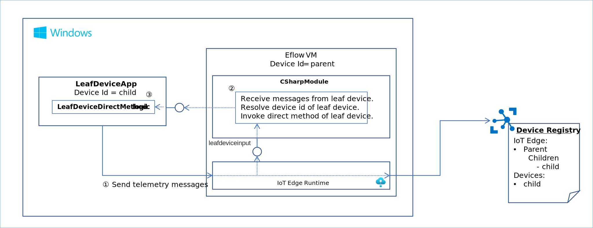

# IoT Edge Eflow Gateway Sample- Additional Information  
このコンテンツは、https://github.com/Azure/iotedge-eflow/tree/main/samples/interop-textmsg-consoleapp を試した時に色々と引っ掛かったので、メモとして間違いそうなところを解説しておく。  
先ずは、構成要素が多いので、図示しておく。  
  

※ Eflow(Azure IoT Edge for Linux on Windows) は、Windows 上の Virtual Machine で動いていて、Leaf Device のロジックは、Windows のホスト上で動いている。  
※ Windows のホスト上で動いている Leaf Device ロジックが IoT Hub にテレメトリーデータを送信すると Eflow の IoT Edge Runtime が CSharpModule にテレメトリーデータを転送し、CSharpModule はそのメッセージから送信してきたダウンストリームデバイスの Device Id を取り出し、そのダウンストリームデバイスの Direct Method をコールする。  
※ CSharpModule の、ダウンストリームデバイスの Direct Method Invocation は、IoT Edge Runtime が、Leaf Device に転送し、Leaf Device ロジックが要求を受け取る。  

以下、引っ掛かりそうなポイントを記載していく。  

## Step 5: Create Certificates for Authentication  
Link -> https://github.com/Azure/iotedge-eflow/blob/main/samples/interop-textmsg-consoleapp/Documentation/Create%20Certificates%20for%20Authentication.MD  

Repository の clone、Docker による Build & Run は、Windows のホスト上で行う事。  
※ Eflow の Virtual Machine 上のシェルと勘違いしないように気をつけて。（もしかすると問題ないのかもしれないが、間違いやすいので念のため）    


## Step 7: Configuring the IoT Edge Device.  
Link -> https://github.com/Azure/iotedge-eflow/blob/main/samples/interop-textmsg-consoleapp/Documentation/Configuring%20the%20IoT%20Edge%20Device.MD  

/etc/iotedge/config.yaml の <b>hostname</b> を設定するところで、DNS を使っていない場合は、以下のコマンドをPowerShell（管理者）で実行して取得した IP アドレスを使用する事。  
```sh
Get-EflowVmAddr
```
Windows で通常使う ipconfig コマンドでは表示されない。  
hostname の設定が間違っていると、CSharpModule の AMQP による Edge Hub への接続が失敗するので、そんな症状が出ていたら、設定の確認をお勧めする。  

## Step 9: Run the Console Application  
Link -> https://github.com/Azure/iotedge-eflow/blob/main/samples/interop-textmsg-consoleapp/Documentation/Run%20the%20Console%20Application.MD  

ビルド済みの EXE ファイルをコマンドプロンプトで実行する場合、コマンドプロンプトは<b><u>管理者権限</u></b>で実行する事。  
Visual Studio 2019 や VS Code でも、管理者権限で実行すれば、デバッグも可能。  

TLS Authentication Errorが発生する場合は、[ゲートウェイ接続をテストする](https://docs.microsoft.com/ja-jp/azure/iot-edge/how-to-connect-downstream-device?view=iotedge-2020-11#test-the-gateway-connection)を参考に、テストしてみる。openssl で接続できなければ当然接続できないので、    
- 正しく証明書が作られているか？  
- 正しく証明書が設定されているか？  
- 正しいゲートウェイホスト名を指定しているか？  
を確認する事。  

以上、引っ掛かりそうなポイントを解説。  
因みに、IoT Edge 上の CSharpModule の Leaf Device からのテレメトリーデータ受信、及び、Leaf Device の Direct Method Invocation は、IoT Hub を介さない。つまり、Eflow が動いている Windows PC（Server）内だけでの通信で行われている。  

## 最後に  
Special Thanks for motojin.com !
